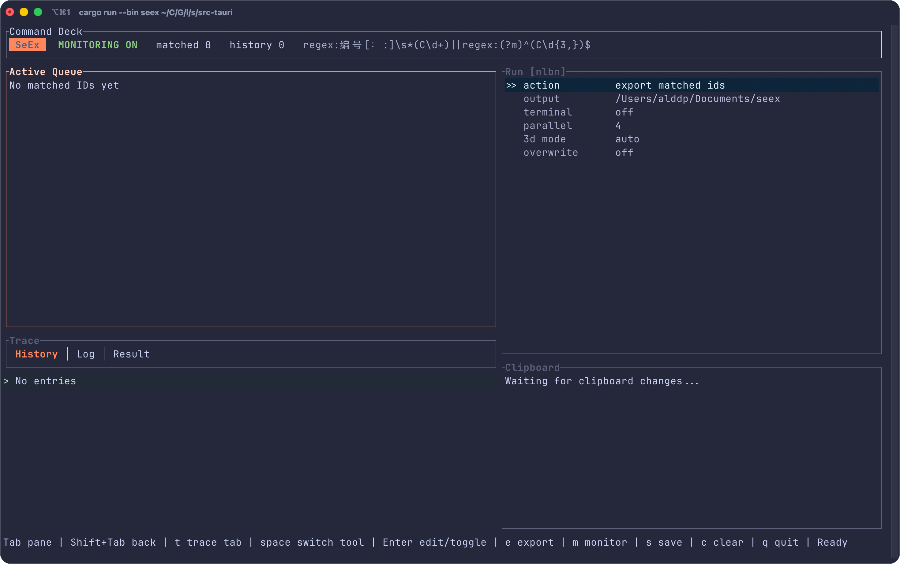
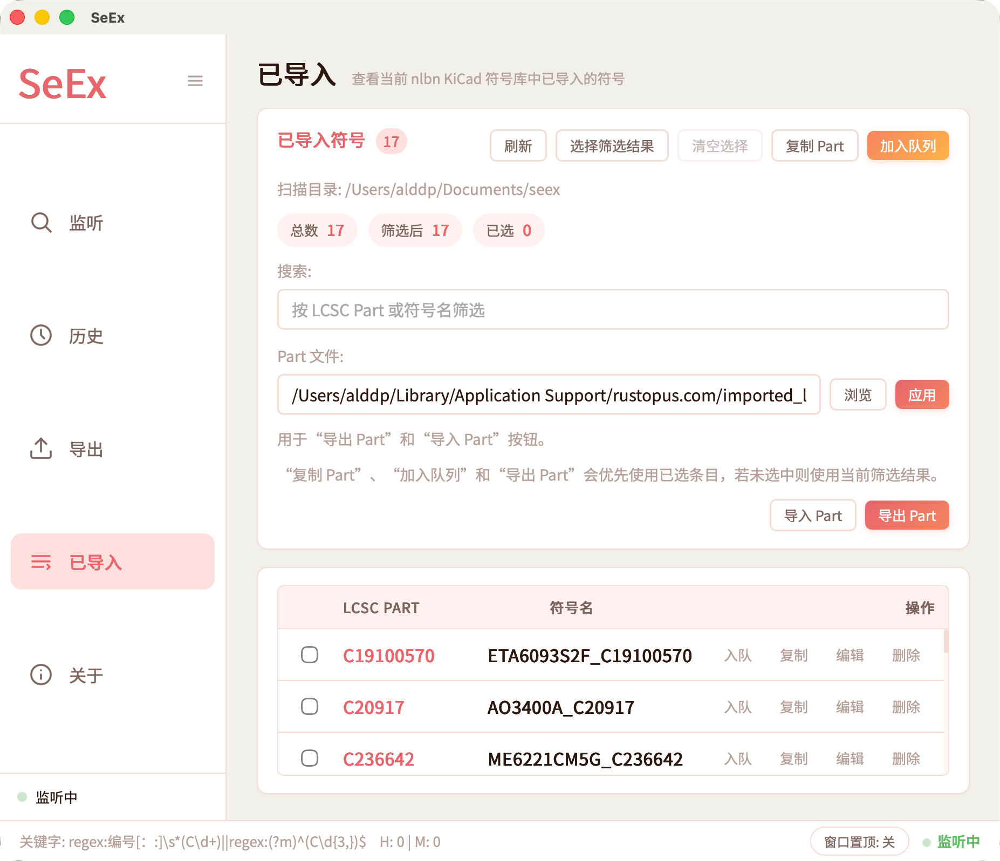
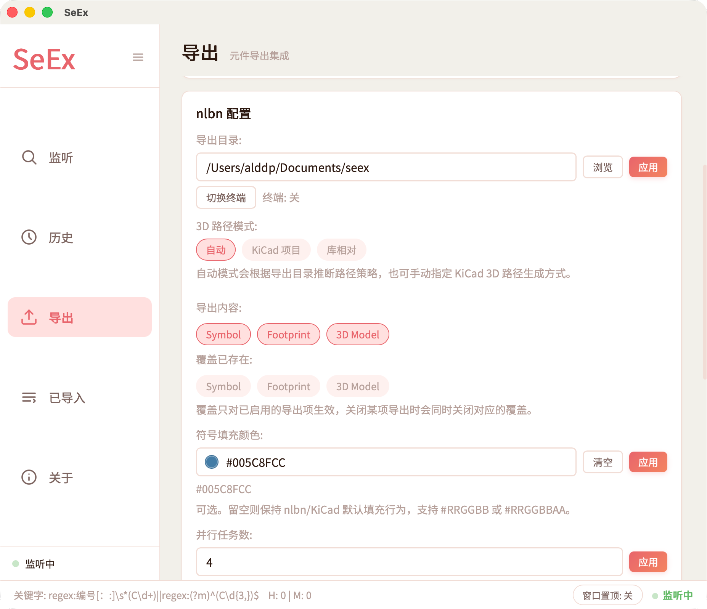

# SeEx 自用优化版

这是我基于原项目改出的自用版本，重点针对 **macOS + KiCad** 工作流优化，不是通用发行版，也不承诺覆盖所有平台和旧版本兼容。

- 本仓库地址：https://github.com/Alddp/seex
- 原项目地址：https://github.com/linkyourbin/seex
- 许可证：CC BY-NC 4.0，继承自原项目

## 和原项目的区别

- 面向 macOS 和 KiCad 使用场景调整导出流程，Windows 未经测试。
- 中文优先界面，移除了语言切换逻辑。
- 增加已导入符号管理，用于查看、筛选和维护现有 `nlbn` KiCad 库。
- 支持编辑已导入符号的符号名和 LCSC Part。
- 支持导出/导入已导入 LCSC Part 列表，方便把现有库重新加入导出队列。
- `nlbn` 导出内容可单独控制：符号、封装、3D 模型可以分别启用。
- `nlbn` 覆盖策略可单独控制，避免误覆盖已有库资产。
- `nlbn` 3D 模型路径模式可配置：自动、KiCad 项目相对路径、库相对路径。
- 支持 `nlbn` 符号填充色覆盖。
- 改进 `nlbn` 和 `npnp` 的导出进度反馈。
- 增加 `npnp` 合并追加模式。
- 增加窗口置顶开关，并持久化窗口尺寸。
- 运行时会检查新版 `nlbn` 参数能力，避免用旧版二进制执行不兼容导出。

这个版本会使用较新的 `nlbn` 参数，例如 `--overwrite-symbol`、`--overwrite-footprint`、`--overwrite-3d`、`--project-relative` 和 `--symbol-fill-color`，建议搭配我的 `nlbn` 自用优化版：

https://github.com/Alddp/nlbn

## 平台和兼容性说明

- 主要目标环境：macOS + KiCad。
- Windows 未经测试。
- 不再考虑 KiCad v5 兼容，相关兼容逻辑已经从配套 `nlbn` 中移除。
- 这个仓库按个人工作流优化，功能取舍会优先服务自己的 KiCad 元件库维护方式。

## TUI 状态

项目里有一个 `seex-tui` 终端入口，但目前功能不完整，且已经暂时暂停开发。它保留在仓库中，主要用于后续可能继续实验终端工作流。

  

## 截图

  

  

## License

This project is licensed under CC BY-NC 4.0.
